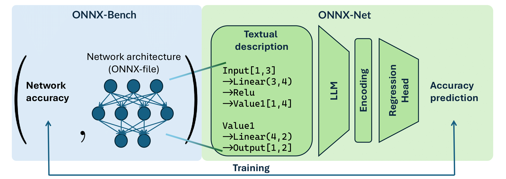

# ONNX-Net: Towards Universal Representations and Instant Performance Prediction for Neural Architectures

[](https://github.com/shiwenqin/ONNX-Net)
[](https://huggingface.co/datasets/carlosqsw/ONNX-Bench)
[](https://shiwenqin.github.io/onnxnet/)
[](https://arxiv.org/abs/2510.04938)

## ✨ Highlights

- 🤗 **ONNX-Bench**: 649,596 trained models across diverse NAS spaces in a unified ONNX format with CIFAR-10 accuracy labels (1–3503 nodes; accuracy range [0.0, 97.03]).
- 🧠 **Universal encoding**: Our encoding supports all ONNX architectures.
- 🚀 **Instant prediction**: LLM-based surrogate enables fast performance prediction, suitable for speeding up NAS pipelines.

## 🏗️ Architecture



## ⚙️ Environment Setup

```bash
git clone https://github.com/shiwenqin/ONNX-Net.git
cd ONNX-Net
pip install -r requirements.txt
```

## 📁 Important Folders

```
.
├── src/                             # Contains all main source code
│   ├── process/                     # Contains codes for text encoding generation
│   └── bert_inference.py            # Code for surrogate inference
│   └── bert_tuning.py               # Code for surrogate training
│   └── losses.py                    # Various loss functions tried
├── scripts/                         # Contains example scripts for running experiments
├── .gitignore         
├── requirements.txt
└── README.md          
```

## 🧩 Encoding Generation

Multiple variations of ONNX text encoding is implemented in `src/process/utils.py`. `chain_slim` is used for most experiments, and `chain_slim_base`, `chain_slim_param`, `chain_slim_outshape` and `chain_slim_input` are used in ablation study.

Example script for encoding generation is given in `src/process/gen_onnx.py`. If using your own ONNX files, it is highly recommended to first process the files using [ONNX Simplifier](https://github.com/daquexian/onnx-simplifier). Files in [ONNX-Bench](https://huggingface.co/datasets/carlosqsw/ONNX-Bench) are all processed so no further simplification is required.

## 🏃‍♀️ Surrogate Training

Scripts to reproduce results in paper are given in `scripts/`.

Basic command to train a surrogate model on given encoding file:

```bash
accelerate launch --num_processes 4 src/bert_tuning.py \
        --model_name answerdotai/ModernBERT-large \
        --data_path YOUR_ENCODING_FOLDER \
        --output_path OUTPUT_PATH \
        --batch_size 16 \
        --epochs 5 \
        --seed 42 \
        --lr 5e-5 \
        --loss_fn pwr \
        --weight_decay 0.1 \
        --eval_strategy epoch
```

## 📚 Citation

If you use this work, please cite us:

```bibtex
@misc{qin2025onnxnetuniversalrepresentationsinstant,
      title={ONNX-Net: Towards Universal Representations and Instant Performance Prediction for Neural Architectures}, 
      author={Shiwen Qin and Alexander Auras and Shay B. Cohen and Elliot J. Crowley and Michael Moeller and Linus Ericsson and Jovita Lukasik},
      year={2025},
      eprint={2510.04938},
      archivePrefix={arXiv},
      primaryClass={cs.LG},
      url={https://arxiv.org/abs/2510.04938}, 
}
```